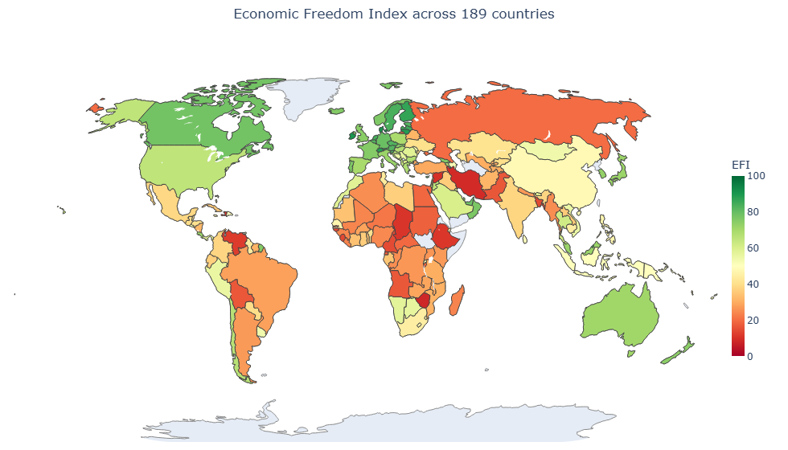

# Index of Economic Freedom

A transparent, reproducible country-level composite indicator of **economic freedom**, built from raw public international data following the OECD ten-step methodology for composite indicators (Nardo et al., 2008).

The final index covers **189 countries** using the latest observation available up to 2024, and is the equal-weight average of two surviving conceptual blocks:

- **Institutions** — mean of Rule of Law and Regulatory Quality (from WGI).
- **Open Markets** — mean of Trade openness, Tariff rate and Inflation (from WDI).

A third provisional block — *Limited Government* — was tested and ultimately dropped after failing all three diagnostic checks (PCA, k-means clustering, and an external regression against log GDP per capita PPP).

---

## Final result



*World map of the Economic Freedom Index across 189 countries — green indicates higher freedom, red indicates lower.*

**Top of the ranking:** Singapore, Denmark, Hong Kong SAR (all above 90/100). Ireland ranks 4th.
**Bottom of the ranking:** Zimbabwe, Iran, Syria (all below 10/100).

---

## How to run

The raw data files ship compressed inside `WDI_WGI.zip` to keep the repository small (the main `WDICSV.csv` alone is ~141 MB uncompressed).

1. **Extract `WDI_WGI.zip`** into the project root. After extraction you should see the following files next to `CA.ipynb`:
   - `WDICountry.csv`
   - `WDICSV.csv`
   - `WDISeries.csv`
   - `wgidataset_with_sourcedata-2025.xlsx`

2. **Open and run `CA.ipynb`** end to end. The notebook runs cell by cell with no hidden state — every derived object is displayed as it is built, and a fixed random seed (`random_state=42`) is used in k-means so results are deterministic across re-runs.

3. **Output.** The final ranking is written to `economic_freedom_ranking.csv` in the project root.

Requirements: Python 3.10+ with `pandas`, `numpy`, `scikit-learn`, `matplotlib`, `seaborn`, `plotly`, `openpyxl`.

---

## Data sources

| Source | File | Contribution to the index |
|---|---|---|
| World Development Indicators (World Bank, 2024) | `WDICSV.csv`, `WDICountry.csv`, `WDISeries.csv` | Trade openness, tariff rate, inflation (plus GDP per capita PPP, used only for external validation — never as an input). |
| Worldwide Governance Indicators, 2025 release (Kaufmann & Kraay, 2024) | `wgidataset_with_sourcedata-2025.xlsx` | Rule of Law, Regulatory Quality and Control of Corruption, on a 0–100 percentile scale. |

---

## Methodology at a glance

The notebook follows the OECD ten-step method, organised around the same numbered sections as the written report:

1. **Theoretical framework** — nine candidate indicators assigned to three provisional blocks (Institutions, Limited Government, Open Markets).
2. **Data selection** — a rolling "latest available up to 2024" rule is adopted over a strict 2024-only rule, which more than doubles country–indicator coverage.
3. **Imputation** — median imputation, applied only after a strict per-block coverage pre-filter so that no country's block score is dominated by imputed values.
4. **Multivariate analysis** — correlation, PCA and k-means clustering. Two near-duplicate indicators are dropped, and the entire Limited Government block is dropped for moving against the dominant freedom axis.
5. **External validation** — a multiple linear regression against log GDP per capita PPP gives the third, independent piece of evidence against Limited Government.
6. **Normalisation** — percentile rank (robust to extreme values such as Argentina's inflation or Zimbabwe's hyperinflation history).
7. **Weighting and aggregation** — equal weights at every level, arithmetic mean.

Full write-up, including all figures and the complete 189-country ranking, is available in `Economic_Freedom_Index_Report.pdf`.

---

## Project files

```
├── CA.ipynb                             # canonical analysis notebook
├── WDI_WGI.zip                          # compressed raw data (extract before running)
├── Economic_Freedom_Index_Report.docx   # full methodology write-up
├── economic_freedom_ranking.csv         # final output (created by the notebook)
├── world_map.png                        # final world-map figure
└── README.md                            # this file
```

---

## References

- Nardo, M., Saisana, M., Saltelli, A., Tarantola, S., Hoffman, A., & Giovannini, E. (2008). *Handbook on Constructing Composite Indicators: Methodology and User Guide*. OECD / Joint Research Centre, European Commission.
- Kaufmann, D., & Kraay, A. (2024). *Worldwide Governance Indicators*, 2025 update. World Bank.
- World Bank. (2024). *World Development Indicators 2024*. The World Bank Group, Washington D.C.